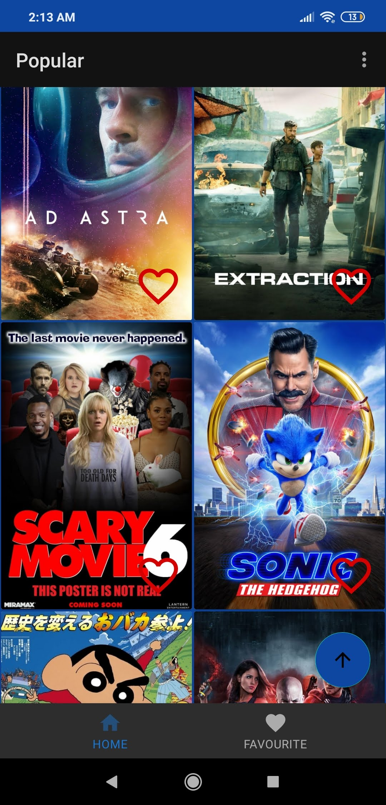
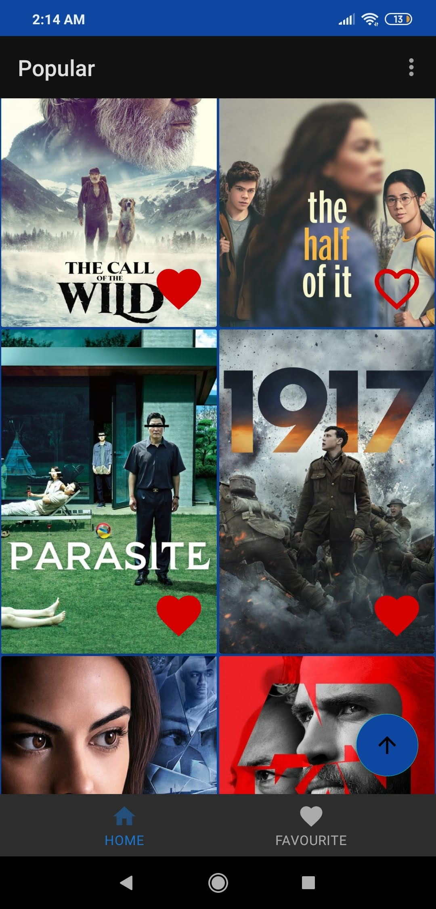
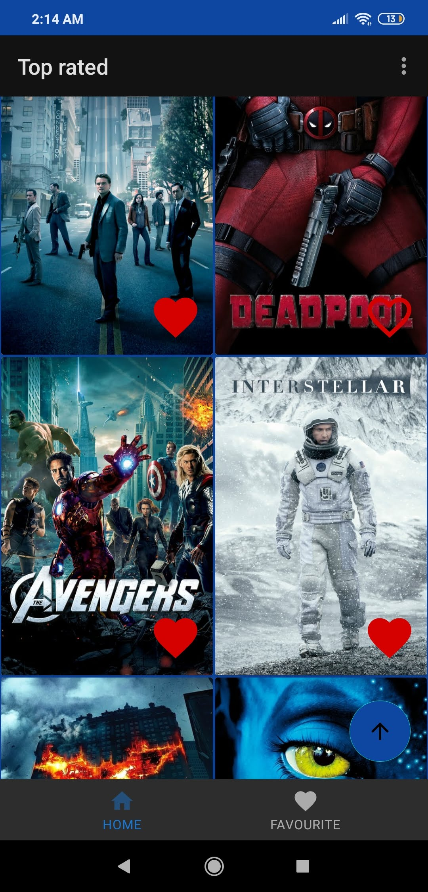
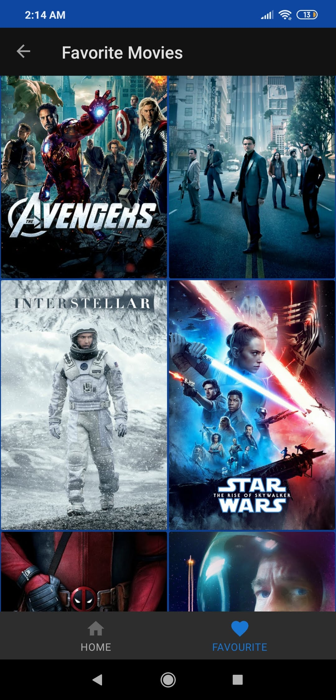
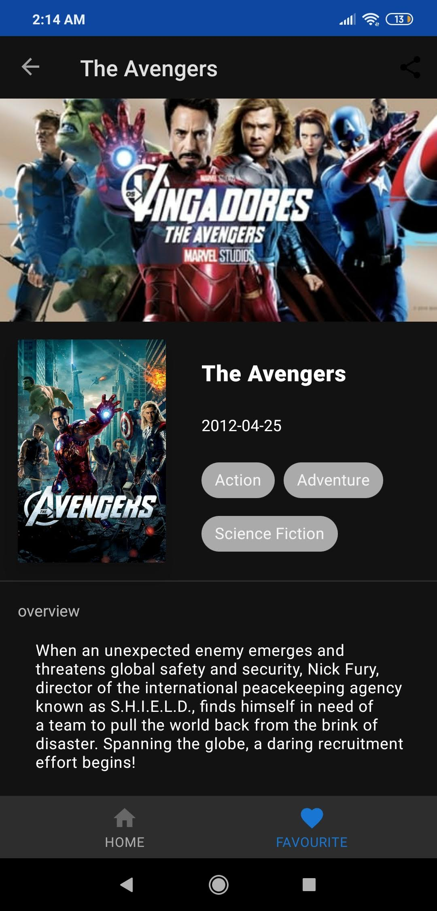
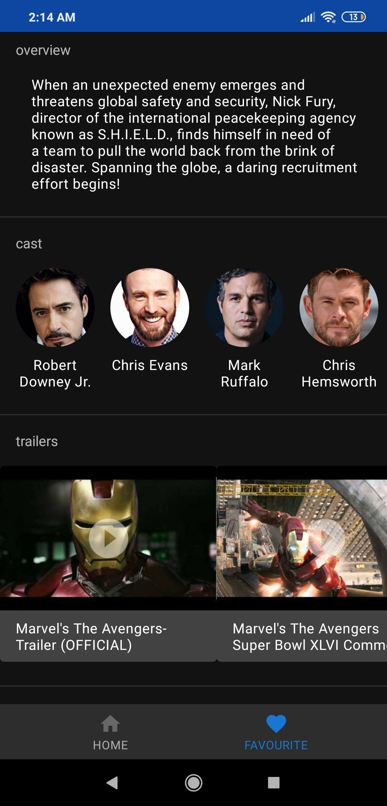
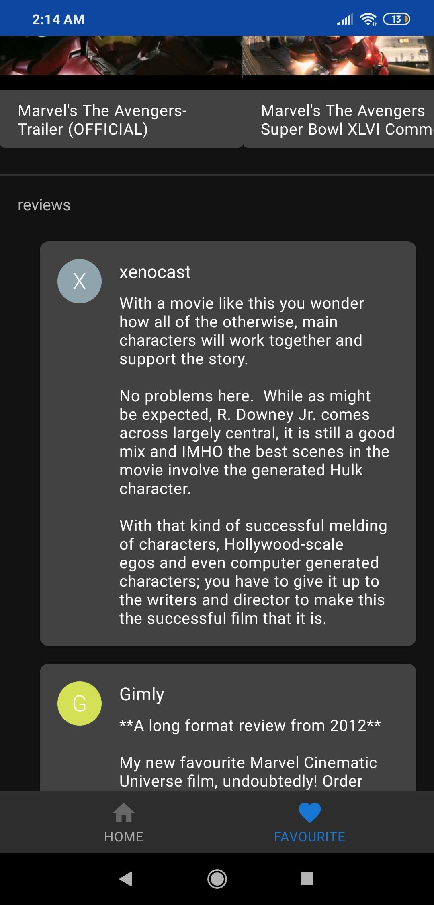

"Movie Plus"

 

 

 

 

A Movie browsing android application that allows the user to browse popular and top-rated movies, see movies details, casts, trailers, reviews, posters, adding them to your favorite list and can run offline, it is built using themoviedb API.

it uses:

1-MVVM with Android Architecture Components:

-Room Persistence Library: an abstraction layer over SQLite to allow for more robust database access, and allowing the app to run offline.

-LiveData: an observable data holder class that is lifecycle aware.

-ViewModel: A class that store and manage UI-related data in a lifecycle conscious way, and allows data to survive configuration changes such as screen rotations.

-Data Binding Library: allows you to bind UI components in your layouts to data sources in the app.

-Paging library: for pagination and endless scrolling of movies, and using Boundary Callback for better user exprience.

-Navigation component: to handle fragments navigation.

2-Retrofit: to connect to themoviedb and fetch data in an asynchronous way.

3-Gson - for serialization/deserialization Java Objects into JSON and back.

4-Fragments: a modular section of an activity to to build a multi-pane UI for tablets.

5-RecyclerView, GridView and Adapters: to view movie posters in a scrollable list.

6-ConstraintLayout: to build the UI for the movie detail fragment
